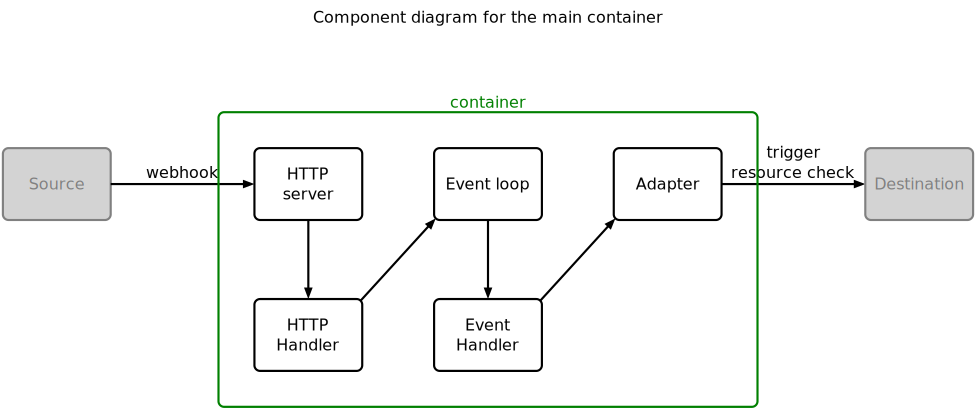

# Controlling concurrent actions

## Design

This project uses the [C4 model](https://c4model.com/) for diagrams and terminology.

With reference to the above diagram, the "Event loop" is the only fixed component in this project. All the others are added to make an example application.

The Event loop requires at a minimum an event handler and some events injected into it. In the example diagram, events are injected by the HTTP handler.

## Development strategy

- Incremental (walking skeleton).
- Two-level TDD, as described by [GOOS], but with as little as possible of test doubles ([GOOS without mocks]):

Image courtesy of [GOOS].

In particular, we will assume that the system is simply the event loop plus the event handler.

Useful: [Ways To Do Things](https://www.youtube.com/watch?v=LHe1Cb_Ud_M)

Incremental delivery:

- hardcoded event type
- custom event type

## C4 model terminology

- **C4 container** an application or a data store: something that needs to be running in order for the overall software system to work. A container is a separately deployable/runnable thing or runtime environment, typically (but not always) running in its own process space.
- **C4 component** a grouping of related functionality encapsulated behind a well-defined interface. All components inside a container typically execute in the same process space. components are not separately deployable units. 

[GOOS]: http://www.growing-object-oriented-software.com/
[GOOS without mocks]: https://enterprisecraftsmanship.com/posts/growing-object-oriented-software-guided-by-tests-without-mocks/
[Ways To Do Things]: https://www.youtube.com/watch?v=LHe1Cb_Ud_M
